# 服务架构的进化之路  
## 服务演进概览学习汇报  
### 引言  
知识内容学自《凤凰架构》，以时间顺序介绍从原始分布式时代到无服务时代的发展，基本包含各个系统时代的特点及优缺点。
### 原始分布式时代  
（比单体时代更早的分布式）  
特点：追随透明化、简单化，使开发人员不必过于关注相关资源是本地还是远程。  
优点：完成了对RPC、DFS等概念的开创，是很多现代服务标准的鼻祖。  
缺点：速度、服务发现、负载均衡等n个问题。实操性不好。  
### 单体系统时代  
特点：进程内调用，最简单，最广泛，运行效率最高，“巨石系统”。  
优点：简单高效。  
缺点：漏洞是全局性的，难隔离的；必须使用同一种编程语言和框架。  
（尽管如此，对于规模小的项目，单体系统依然是很好的选择，因为它在效率上有绝对优势。）  
### SOA时代  
#### 烟囱式架构（完全不交互）  
#### 微内核架构  
  
优点：及时更新，子插件可以和主系统交互  
缺点：子系统完全无法交互  
#### 事件驱动架构  
  
优点：信息可以在插件之间交互  
（进入SOA时代，进行了更具体、更系统的改进，但严格的规范性带来过度复杂性，编码也像八股文一样变得无趣。）  
### 微服务时代  
特点：通过小的服务组合来构架应用。  
优点：可以使用不同的语言和数据储存技术，轻量级，自动化，容错性强，产品化思维，通信简单，较SOA更加自由。   
缺点：对架构者难度大   
### 后微服务时代  
特点：软硬一体，虚拟化，容器化。  
“边车代理模式”：  
  
### 无服务时代  
并不是继承了微服务，是云原生的起点  
特点：“不分部式”的云端系统  
优点：降低开发成本，资源共享  
缺点：性能不太好  
# 完   

## 容器化与Docker  
接下来是有关Docker相关内容的学习  
### 概念了解  
Docker：集装箱，程序与其环境打包。  
镜像：一个静态的，只读的模板。包含运行所需的一切。  
容器：是镜像的一个运行实例。是轻量级的、可执行的独立环境。  
引擎：安装在操作系统上的一个程序，负责创建和运行程序。  
### 常用指令（实际指令中<>并不存在）  
1.docker pull<镜像名>:从仓库下载镜像到本地    
2.docker images:查看本地已下载的镜像  
3.docker run -d -p <主机接口>:<容器端口> --name<容器名><镜像名>   ：创建并启动容器  
4.docker stop <容器名>：停止容器  
5.docker start <容器名>：启动已停止的容器  
6.docker rm <容器名>：删除容器  
7.docker ps:查看容器状态  
8.docker exec -it <容器名>/bin/bash:进入容器内部  
### 相关了解  
Dockerfile:  
一个文本文件，里面包含了一条条指令，这些指令告诉Docker如何按步骤组装出一个完整的镜像。（说明书）  
Docker compose:  
·一个用于定义和运行多容器的Docker应用的工具。（重点在定义多个容器如何协同工作）需要一个项目文件docker-compose.yml作为基底，进行docker compose。    
# AI   
详情见另一文件夹

