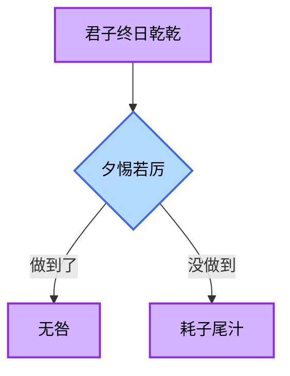

# Git相关问题解答  
## 1.Git初识
## 2.Git是啥？它有什么用？为什么要用Git？  
### 含义   
Git是一个支持多人共同编写代码与保存修改记录的平台工具。  
### 作用  
- 保存每一次的修改记录、时间、修改者  
- 多人共同操作统一代码，自动合并修改记录 
### 优点  
- 版本回溯无风险  
- 多人协作不冲突  
- 离线工作不受限  
- 分支管理更灵活  
### 缺点  
- 命令指控多，对新手不友好，有学习门槛  
- 大型项目的分支不好管理  
## 3.Git实战        
<br><br><br>
# markdown文档使用
## 我永远喜欢SynX  
> <font color="gold">因为昨天的事情</font>  
> 必定，是无法改变的  
> - ~~稍稍，休息一会~~  
> - 再次，<u>系好鞋带</u>  
   
>吾之忠诚，献予**高阶领主**  
>>死亡舰队降临这个世界！   

<font color="green">print("Ciallo~")</font>   
注：我不知道怎么回事，转成pdf格式就无法显示流程图


<br><br><br>
# VSCode  
## ASCLL码   
- 原因：字符类型char是整数类型，是直接存储ASCLL码值的类型，它储存的是字符对应的ASCLL码值。而a所对应的值是97。  
<br>
 ```c  
#include<stdio.h>
int main()
{
    char a='1';
    a=a-'0';
    printf("%d",a);
    return 0;
}  
```  
- 区别：赋值的'1'是字符，有对应特定编码；输出的1是数字，就是数学意义上的数字。  
## 数组  
- 第1问
```c  
#include<stdio.h>
int main()
{
    int a,b,c,d,e,f,g;
    printf("请输入5个同学的成绩：\n请输入第1个同学的成绩：\n");
    scanf("%d",&a);
    printf("请输入第2个同学的成绩：\n");
    scanf("%d",&b);
     printf("请输入第3个同学的成绩：\n");
    scanf("%d",&c);
     printf("请输入第4个同学的成绩：\n");
    scanf("%d",&d);
     printf("请输入第5个同学的成绩：\n");
    scanf("%d",&e);
    f=a+b+c+d+e;
    g=f/5;
    printf("5个学生的平均分是：%d",g);
    return 0;
}
``` 
- 第2问  
```c
#include <stdio.h>
int main() {
    int n;
    float score, sum = 0, average;
    printf("请输入学生人数：");
    scanf("%d", &n);
    printf("请输入%d个学生的成绩：\n", n);
    for (int i = 1; i <= n; i++) {
        printf("请输入第%d个学生的成绩：", i);
        scanf("%f", &score);
        sum += score;
    }
    average = sum / n;
    printf("%d个学生的平均分是：%.2f\n", n, average);

    return 0;
}  
```  
- 第3问 
```c
#include <stdio.h>
int main() 
{
    int count[101]={0};
    int n;
    float score, sum = 0, average;
    printf("请输入学生人数：");
    scanf("%d", &n);
    printf("请输入%d个学生的成绩：\n", n);
    for (int i = 1; i <= n; i++) {
        printf("请输入第%d个学生的成绩：", i);
        scanf("%f", &score);
        sum += score;
    }
    average = sum / n;
    printf("%d个学生的平均分是：%.2f\n", n, average);
   
   
    printf("分数分布统计:\n");
    printf("分数\t人数\n");
    printf("==========\n");
    for(int i=0;i<=101;i++)
    {
        if(count[i]>0)
        printf("%d\t%d\n",i,count[i]);
    }

    return 0;
}   
```  
第3问注释：大概思路是通过计数统计，先建立一个数组并初始化均为0，每输入一个成绩，就在对应分数下标的数组值加1，再遍历数组，只输出人数大于0的分数及其对应人数。（但具体我不会操作，这段代码无法统计出分数分布情况。）  
## 循环结构  
- 阶乘
```c  
#include<stdio.h>
int main()
{
    int n;
    long long m=1;
    printf("请输入一个非负整数：\n");
    scanf("%d",&n);
    
    for(int i=1;i<=n;i++)
    {
        m*=i;
        
    }
    printf("%d!=%lld",n,m);
    return 0;

}
```
- 斐波那契数列  
```c  
#include <stdio.h>

int main()
 {
    int n, count = 0;
    long long a = 0, b = 1;
    printf("请输入打印项数:");
    scanf("%d", &n);
    printf("斐波那契数列前%d项为:", n);
    while (count < n)
     {
        printf("%lld ", a);
        long long next = a + b;
        a = b;
        b = next;
        count++;
    }
    
    printf("\n");
    return 0;
}  
```  
- 函数，递归函数  
```c  
#include <stdio.h>

long factorial(int n) {
    if (n == 0) {
        return 1;
    } else {
        return n * factorial(n - 1);
    }
}

int main() {
    int number;
    
    printf("Enter a non-negative integer: ");
    scanf("%d", &number);
    
    if (number < 0) {
        printf("Error: Factorial is defined only for non-negative integers.\n");
    } else {
        long result = factorial(number);
        printf("%d! = %ld\n", number, result);
    }
    
    return 0;
}  
```

## 指针  
- 指针基础概念
```c  
# include<stdio.h>
int main()
{
    int num=10;
    int *ptr=&num;
    printf("num的值:%d\n",*ptr);
    printf("num的地址:%p\n",ptr);
    *ptr=20;
    printf("修改后num的值:%d\n",num);
    return 0;
}
```  
- 指针与数组的关系  
```c
#include<stdio.h>
int main()
{
    int arr[5]={1,2,3,4,5};
    int *ptr=arr;
    for (int i=0;i<5;i++)
    {
        printf("arr[%d]=%d",i,*ptr);
        printf("，地址：%p\n",ptr);
        ptr++;
    }
    return 0;

}
```  
- 指针的运算  
```  
10  
20  
11  
20 
```  
- swap  
```c  
#include <stdio.h>

void swap(int *a, int *b) {
    int temp = *a;
    *a = *b;
    *b = temp;
}

int main() {
    int x = 10, y = 20;
    printf("交换前:x = %d, y = %d\n", x, y);
    swap(&x, &y);
    printf("交换后:x = %d, y = %d\n", x, y);
    return 0;
}  
```
basic解答结束啦！


